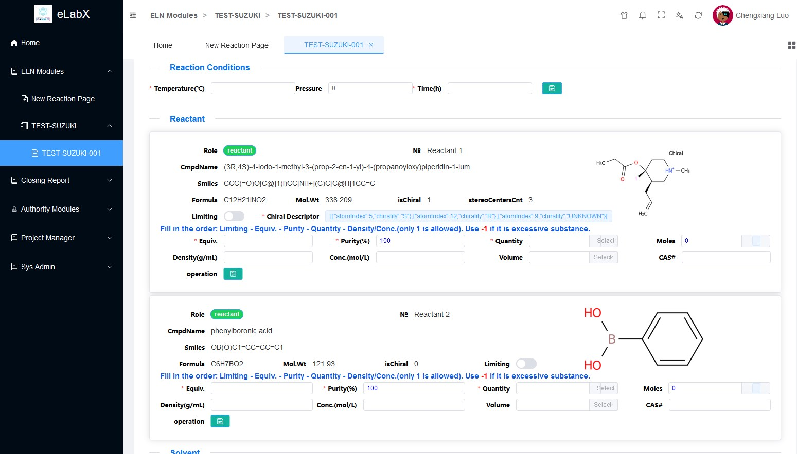
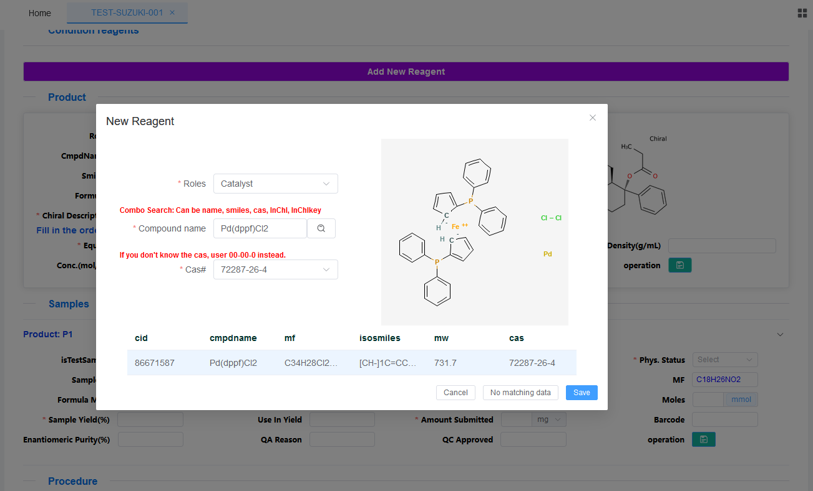
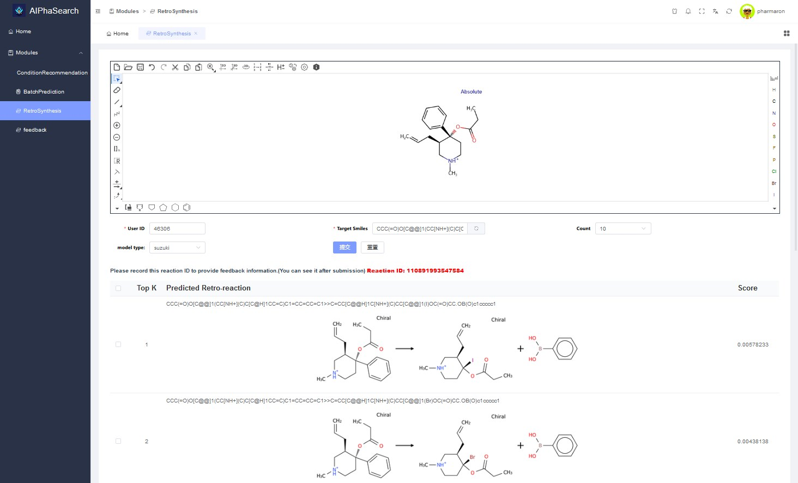
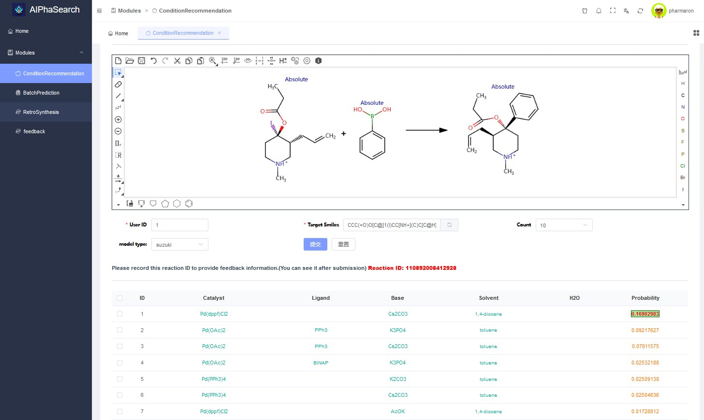
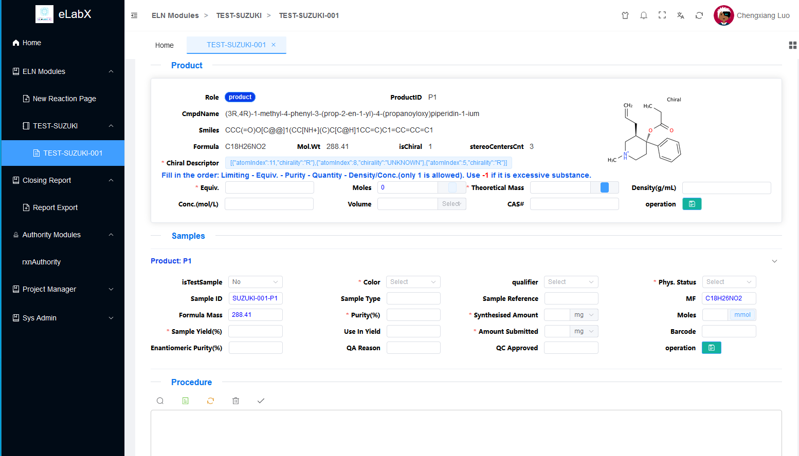
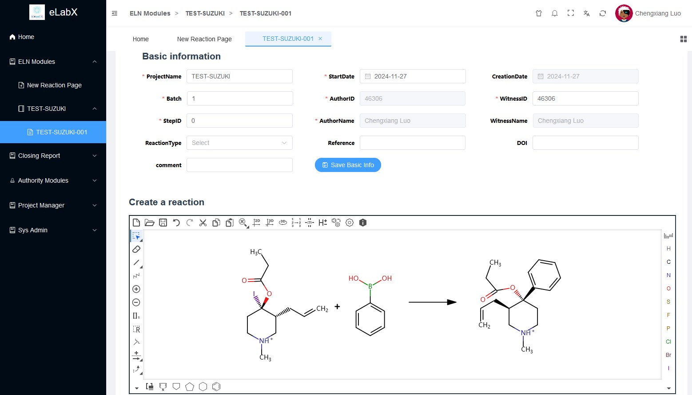

<h1 align="center">eLabX</h1>
<p align="center"><strong>An AI-driven Electronic Laboratory Notebook (ELN)</strong></p>

---

## 🌟 Introduction

**eLabX** is an open-source, AI-driven electronic laboratory notebook (ELN) system built with:

- 💻 Frontend: [Vben-Admin](https://github.com/vbenjs/vue-vben-admin) + [Element Plus](https://element-plus.org/)
- 🔧 Backend: [Gin](https://gin-gonic.com/) + [GORM](https://gorm.io/)
- 🧠 AI Support: Integration-ready with OpenAI for auto-lab-note summarization, analysis, etc.

It is designed to help researchers, chemists, and engineers record and organize experimental data efficiently.

---

## 🖼️ Screenshots

Here are some highlights of eLabX in action:

|  |  |
|---|---|
| **概览 Overview**<br> | **新增试剂 Add New Reagent**<br> |
| **逆合成 Retrosynthesis**<br> | **条件推荐 Condition Recommendation**<br> |
| **产品信息与样品 Product Info & Sample**<br> | **Embed Marvin JS**<br> |

---

## 🚀 Features

- 📁 Manage experiments, protocols, and samples
- 🧠 AI-assisted text summarization and suggestions
- 🔐 User authentication and role-based access control
- 📊 Data table with dynamic sorting/filtering (vben-admin)
- 📂 Export/Import records
- 🌐 RESTful API backend with Gin
- 📦 Modular frontend using Vue 3 + Vite

---

## 📦 Tech Stack

| Layer     | Tech                            |
|-----------|---------------------------------|
| Frontend  | Vue 3, Vben-Admin, Element Plus |
| Backend   | Gin, GORM, MySQL/Postgres       |
| AI (opt)  | OpenAI API or custom LLMs       |
| Auth      | JWT                             |

---

## 📄 Installation

### Backend

```bash
cd server
go mod tidy
go run main.go
````

### Frontend

```bash
cd web
pnpm install
pnpm dev
```

Configure environment variables in `.env` and `config.yaml`.

---

## 🛠️ Project Structure

```bash
eLabX/
├── web/                # Frontend (Vue + Vben-Admin)
├── server/             # Backend (Gin + GORM)
├── docs/               # Optional docs
├── README.md
└── LICENSE
```

---

## 📌 Roadmap

* [x] CRUD for lab notes
* [x] AI summarization
* [ ] Multi-user collaboration
* [ ] Full audit trail
* [ ] Mobile support

---

## 🤝 Contributing

Contributions are welcome! Please fork the repo and submit a pull request.

1. 🍴 Fork it
2. 🧩 Create your feature branch (`git checkout -b feature/thing`)
3. 🧪 Commit changes (`git commit -am 'Add feature'`)
4. 📬 Push and submit PR

---

## 📜 License

This project is licensed under the **MIT License**.

> You can find it in the [`LICENSE`](./LICENSE) file.
> If you're using third-party libraries (like OpenAI SDK), check and **respect their licenses too.**

---

## 📬 Contact

Created by chengxiang.luo – feel free to reach out!

Email: `chengxiang.luo@foxmail.com`
GitHub: [@cx-luo](https://github.com/cx-luo)

---

## 🌐 Languages

* 🇨🇳 中文文档：[README.zh.md](docs/README.zh.md)
* 🌍 English (this file)
